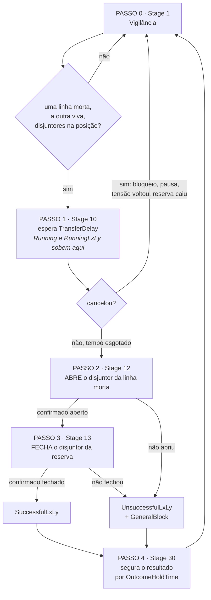
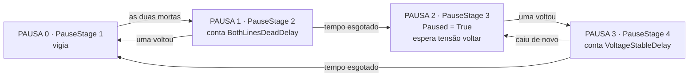
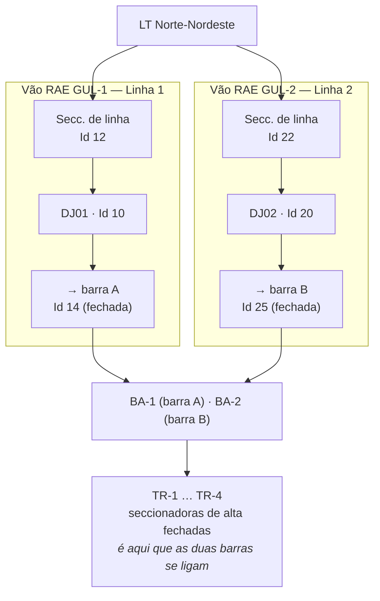

# TAL — Transferência Automática de Linha (88/138 kV)

**Especificação:** *Descritivo de Funcionalidades SPMCSD — 10. Transferência em Alta
Tensão, Rev. 4* ([`docs/edp/`](edp/)), seções 10.1 a 10.4.2.
**Lógica de origem:** o automatismo rodava num **SEL RTAC**
([`docs/edp/TAL.pdf`](edp/TAL.pdf) e os dois POUs em
[`docs/edp/tal_logic/`](edp/tal_logic/) — `P_DEFTAL` e `P_TAL`).
**Implementação:** `xatm_TAL`, que **substitui** o RTAC.

> Onde a especificação e o RTAC divergem, manda o RTAC — é o que estava em serviço.
> As divergências estão listadas em [O que mudou](#o-que-mudou).

## O que faz

Transfere a alimentação da subestação de uma linha de transmissão para a outra quando a
linha em serviço **perde potencial**. Duas linhas, dois disjuntores de entrada, um em
serviço e o outro de reserva.

Dois sentidos, **um único objeto**. Qual deles roda não é escolhido: é lido dos
disjuntores no instante do disparo — o que estiver **fechado** é a linha em serviço, o
outro é a reserva. `L1→L2` e `L2→L1` são o mesmo código com as duas pontas trocadas.

| | Linha de origem | Ordem dos comandos |
|---|---|---|
| **TML** (manual, não implementada) | viva | **fecha** a reserva, depois **abre** a que estava em serviço — *make-before-break* |
| **TAL** (automática) | morta | **abre** a que estava em serviço, depois **fecha** a reserva — *break-before-make* |

O mesmo princípio que separa TM de TA em 13,8 kV: fecha-se o caminho reserva antes de
abrir o principal **enquanto houver o que preservar**; quando a linha já caiu, abre-se
primeiro.

---

## Os passos

O objeto guarda o passo corrente em `Data.Stage`. Os números são os do RTAC, para que as
duas listagens possam ser lidas lado a lado.

| Passo | `Stage` | Nome |
|:---:|:---:|---|
| **0** | `1` | Vigilância |
| **1** | `10` | Espera da confirmação da falta |
| **2** | `12` | Abre o disjuntor da linha morta |
| **3** | `13` | Fecha o disjuntor da linha reserva |
| **4** | `30` | Resultado, e volta ao repouso |



---

### Passo 0 · `Stage 1` — Vigilância

Nada roda enquanto não houver por que rodar. O motor dorme e é **acordado por evento**
(ver [O motor](#o-motor)).

| | |
|---|---|
| **Barrado por** | `Blocked` (qualquer bloqueio) ou `Paused` (duas linhas mortas) |
| **Dispara quando** | uma linha está **morta** e a outra **viva**, **e** o disjuntor da morta está **fechado** e o da viva **aberto** |
| **Escreve** | `FromLine`, `OntoLine` — o sentido, travado aqui e constante pelo resto da corrida |
| **Publica** | `Running`, `RunningL<de>L<para>` |
| **Vai para** | Passo 1 |

```vbs
If Dead(1) And Live(2) And PositionOf(1) = 2 And PositionOf(2) = 1 Then src = 1
If Dead(2) And Live(1) And PositionOf(2) = 2 And PositionOf(1) = 1 Then src = 2
```

> **A posição importa tanto quanto a tensão.** Com os dois disjuntores abertos e as linhas
> já numa morta e outra viva, o disparo acontece quando alguém **fecha** um disjuntor — sem
> nenhuma mudança de tensão. É por isso que `Position` também acorda o motor.

---

### Passo 1 · `Stage 10` — Espera da confirmação da falta

Conta `TransferDelay` segundos antes de comandar coisa alguma. É a espera que distingue
uma falta real de um afundamento momentâneo.

**"Em curso" sobe aqui, não no Passo 2** — a transferência está em andamento desde que a
falta foi reconhecida, e é assim que o RTAC faz (`ECurso12` cobre `E` de 2 a 19).

**Quatro coisas cancelam**, e o cancelamento é silencioso: nenhum disjuntor foi tocado,
então **não há resultado a reportar**.

| Cancela | Por quê |
|---|---|
| `Blocked` | alguém bloqueou, ou uma condição de campo derrubou |
| `Paused` | a outra linha também caiu — não há mais para onde ir |
| a linha de origem **voltou** | não há mais o que transferir |
| a linha de destino **caiu** | transferir para uma linha morta não resolve nada |

---

### Passo 2 · `Stage 12` — Abre o disjuntor da linha morta

Comanda `Data.CommandOpenClose = 1` no disjuntor da linha que perdeu potencial e espera a
confirmação de posição.

| | |
|---|---|
| **Prazo** | `CommandTimeout` do **próprio disjuntor** — é ele que conta, não a TAL |
| **Confirmado** | `Position = 1` → Passo 3 |
| **Falhou** | `CommandInProgress = 1` → resultado **mal sucedida** |
| **Já aberto** | não comanda nada, segue direto |

> O RTAC gastava `T_ESP_DJ` (5 s) nisto. Aqui o prazo já existe no `xatm_Breaker` e é ele
> quem levanta `CommandOpenFailed`, que também é um ponto publicado por si só.

---

### Passo 3 · `Stage 13` — Fecha o disjuntor da linha reserva

O espelho do anterior: `Data.CommandOpenClose = 2` no disjuntor da linha viva.

| | |
|---|---|
| **Confirmado** | `Position = 2` → **bem sucedida** |
| **Falhou** | → **mal sucedida** |

> **Não há reversão.** Se o disjuntor da origem abriu e o da reserva não fechou, o primeiro
> **fica aberto**. A especificação manda *"retornar a subestação à condição inicial"*, mas
> isso significaria fechar de volta sobre uma linha que não tem tensão — que é justamente
> por que a transferência começou. O RTAC também não reverte. Ver
> [O que mudou](#o-que-mudou).

---

### Passo 4 · `Stage 30` — Resultado, e volta ao repouso

Segura o resultado por `OutcomeHoldTime` segundos e então apaga tudo.

| | |
|---|---|
| **Bem sucedida** | `SuccessfulL<de>L<para>` sobe. A função **continua em serviço** |
| **Mal sucedida** | `UnsuccessfulL<de>L<para>` sobe **e** `GeneralBlock` trava — exige Reset |
| **Depois do prazo** | resultado e `Running` apagados, `FromLine`/`OntoLine` zerados, volta ao Passo 0 |

**O resultado é evento, não estado.** Se ficasse retido nunca voltaria ao normal, e o
alarme nunca sairia da lista de alarmes ativos — reconhecido ou não. Segurado e apagado, vai
ao log e sai sozinho. O prazo é o que dá a um cliente de Nível 3 que consulta por
interrogação alguma chance de vê-lo.

`GeneralBlock` **não** é apagado aqui: é a falha permanente e espera um Reset. É essa a
diferença entre ele e um resultado.

---

## A pausa — duas linhas mortas

Seção 10.4.2. Com as duas linhas sem potencial **não há para onde transferir**. Isso não é
falha do automatismo, então a função **não bloqueia** — espera.

| Passo | `PauseStage` | O que faz |
|:---:|:---:|---|
| **0** | `1` | vigia; se as duas caírem → Passo 1 |
| **1** | `2` | conta `BothLinesDeadDelay`; se uma voltar antes, volta ao Passo 0. Ao esgotar: **`Paused = True`** |
| **2** | `3` | espera qualquer uma das linhas voltar |
| **3** | `4` | conta `VoltageStableDelay` **relendo a tensão**; se cair de novo, volta ao Passo 2. Ao esgotar: **`Paused = False`** |



> **O Passo 3 relê a tensão — o RTAC não relia.** Lá o temporizador de 120 s corria até o
> fim acontecesse o que acontecesse, de modo que uma tensão que voltava e caía outra vez
> ainda assim liberava a pausa. O resumo de que foi feito diz *"após 120 s com tensão
> estável"*, e estável é o que isto verifica.

`Paused` bloqueia o disparo (Passo 0) e cancela uma espera em curso (Passo 1). **Não** é
bloqueio: some sozinha e não pede Reset a ninguém.

---

## Bloqueios

Avaliados a cada tique, antes dos passos.

| Propriedade | Origem | Trava? |
|---|---|:---:|
| `Enabled` | configuração | — |
| `OperatorBlock` | comando do operador | — |
| `Preconditions` | **expressão** vinculada no painel | — |
| `AutomaticBlock` | **expressão** vinculada no painel | **sim** → `GeneralBlock` |
| `GeneralBlock` | falha de transferência, ou `AutomaticBlock` | **sim** → só Reset apaga |

```vbs
Blocked = (Not Enabled) Or OperatorBlock Or GeneralBlock Or (Not Preconditions)
```

**Por que `AutomaticBlock` trava e `Preconditions` não.** A especificação é explícita:
*"caso ocorra qualquer desvio das condições iniciais … para retornar à condição de serviço
o operador deve novamente realizar o procedimento de seleção"* — não pode voltar sozinha
quando o campo se recupera. `Preconditions` é a pergunta feita **antes** de armar, e uma
porteira viva é o que ela deve ser.

**O que vai na expressão de `Preconditions`.** As condições da especificação que não são
sinal de disjuntor: CBTL em serviço, IEDs em remoto, SF6, CR-1/CR-2 dos transformadores,
e — no lugar do inexistente *seccionador de interligação* — as seccionadoras de barra
(`14` e `25`) e as seccionadoras de alta dos transformadores fechadas. Ver
[Topologia](#topologia).

---

## O motor

`Data.Sequence` é um **contador**, não uma varredura. Roda enquanto `Value >= 0` e para
escrevendo `-1`, do mesmo jeito que `UndervoltageRelay` e `CommandTimer` já param. **Parada
a subestação, nada roda.**

```
         dorme quando:  não habilitada · não vinculada · Stage em repouso
                        e nenhum temporizador de pausa correndo
```

Sete eventos o acordam, e cada um só escreve `Value = 0` — a pergunta é feita num lugar só:

| Acorda | Por quê |
|---|---|
| `Line1HasVoltage`, `Line2HasVoltage` | a linha caiu — ou voltou, que é o que libera a pausa |
| `Line1Position`, `Line2Position` | um disjuntor se moveu, e isso também dispara |
| `AutomaticBlock`, `Preconditions` | expressões vinculadas: têm de travar o bloqueio na hora |
| `Enabled` | editado no painel; nada mais acordaria por ele |

Os comandos acordam pelos seus próprios manipuladores.

**Os vínculos.** `xatm_TAL_OnStartRunning` percorre a pasta da subestação **uma vez**, anota
os dois caminhos e liga `HasVoltage` e `Position` dos disjuntores nas tags locais. Isso não é
otimização de leitura: os disjuntores são escolhidos em tempo de execução pelo layout de
entrada, então **nenhuma expressão escrita no Studio poderia nomeá-los** — sem tags locais
não há o que um evento vigie, e só sobra varrer.

---

## Temporizações

Todas configuráveis, todas em segundos.

| Propriedade | Padrão | RTAC | Rev.04 | Para quê |
|---|:---:|:---:|:---:|---|
| `TransferDelay` | 45 | 45 | 40 | espera antes de comandar (Passo 1) |
| `BothLinesDeadDelay` | 10 | 10 | 10 | duas linhas mortas → pausa |
| `VoltageStableDelay` | 120 | 120 | 150 | tensão de volta e estável → libera a pausa |
| `OutcomeHoldTime` | 5 | 5 | — | quanto o resultado fica de pé (Passo 4) |
| `CommandTimeout` | *do disjuntor* | 5 | 0,5 | prazo de confirmação de manobra |

> **Os padrões são os do RTAC, não os da especificação.** Os dois valores em que eles
> divergem — 45 contra 40, e 120 contra 150 — precisam de confirmação do cliente. O código
> do RTAC ainda traz o `150` num comentário, ao lado do `120` que ficou.

---

## Sinais publicados

| Ponto | 0 | 1 |
|---|---|---|
| `Blocked` | normal | não pode partir |
| `Paused` | normal | duas linhas mortas |
| `Running` | normal | transferência em andamento |
| `RunningL1L2` / `RunningL2L1` | normal | em curso, naquele sentido |
| `SuccessfulL1L2` / `SuccessfulL2L1` | normal | bem sucedida *(pulso)* |
| `UnsuccessfulL1L2` / `UnsuccessfulL2L1` | normal | mal sucedida *(pulso)* |
| `OperatorBlock`, `GeneralBlock` | liberado | bloqueado |
| `Preconditions`, `AutomaticBlock` | — | condições de campo |

> **A polaridade é a nossa, não a da tabela do cliente.** A especificação declara
> `TAL 88: 0 = Bloqueado, 1 = Serviço`; aqui publica-se `Blocked`, ativo em 1. É como
> `xatm_TA` e `xatm_TMTNM` já publicam, e vale a pena ser consistente com o projeto em vez
> de com a tabela.

A lista completa, com tipos, exposições e textos de ajuda, está em
`docs/xatm_TAL_properties.csv`.

---

## Topologia



**Estado normal:** DJ01 fechado na barra A, DJ02 aberto, e as seccionadoras de barra
**paradas onde estão** — a TAL nunca opera seccionadora. Ao fim de uma transferência a
barra B é que fica energizada.

**Onde está o "seccionador de interligação" da especificação.** Não existe em Guarulhos. As
duas barras se ligam **através das seccionadoras de alta dos transformadores**, que ficam
normalmente fechadas — é esse o caminho que faz o DJ02 alimentar o que o DJ01 alimentava, e
é ele também que tornaria real o paralelismo momentâneo da TML.

Isso explica, de passagem, uma coisa que parecia estranha no RTAC: `CondAtiv` exige os **dois**
relés de bloqueio de barra normais, qualquer que seja o sentido. Com as barras ligadas, um
defeito em qualquer uma é defeito no conjunto.

> **Divergência com a documentação de layout.** O projeto traz `CS3993`/`CS3994` para as
> seccionadoras de linha e `CS3995/3996` no vão GUL-**1**, `CS3997/3998` no GUL-**2** —
> o contrário do que diz [`docs/layouts/4T_ring_guarulhos.md`](layouts/4T_ring_guarulhos.md),
> que ainda adverte que a ordem "corre ao contrário". A regra `+4 = barra A`, `+5 = barra B`
> continua válida. **O documento de layout precisa de correção.**

---

## Sinais lidos do disjuntor

A TAL não tem sinais de campo próprios. Lê tudo do `xatm_Breaker`, resolvido por `Id`:

| Propriedade do disjuntor | RTAC | Usada para |
|---|---|---|
| `HasVoltage` | `COMCA` + `TermMag` | é a linha que está morta ou viva |
| `Position` | `PosFe` / `PosAb` | sentido e confirmação de manobra |
| `Data.CommandOpenClose` | `CmdAb_TAL` / `CmdFe_TAL` | os dois comandos |
| `Data.CommandInProgress` | *(temporizador do RTAC)* | falha de manobra |
| `Defective` | `IED_Rem` + `CBTL_Serv` | expressão de `AutomaticBlock` |
| `BusbarLockingOutRelay` | `BA1_AT.CR` / `BA2_AT.CR` | expressão de `AutomaticBlock` |

**`HasVoltage` é um único sinal por linha, decidido no IED.** O elemento de subtensão, a
supervisão do TP e as correntes de fase são combinados lá dentro, de modo que `False`
significa *linha realmente morta* e não *TP com defeito*. Três analógicas comparadas contra
um limiar pertencem ao dispositivo que as mede.

> Com um único bit, para que lado resolve um TP defeituoso é **escolha, não detalhe**, e a
> escolha é **"viva"**: um TP com problema deve fazer o automatismo não agir, nunca fazê-lo
> agir. Isso precisa constar do que for passado ao pessoal de proteção.

---

## O que mudou

### Em relação à especificação Rev.04

| Item | Rev.04 | Aqui | Por quê |
|---|---|---|---|
| Estado após sucesso | 10.3 diz **bloqueia**; 10.4.1 diz **continua em serviço** | continua em serviço | o SR latch do RTAC não tem o sucesso entre os seus *resets* — 10.4.1 prevalece |
| Reversão após falha | retorna à condição inicial | **não reverte** | reverter é fechar sobre uma linha sem tensão; o RTAC também não reverte |
| Correntes ≈ 0 A | exigido | **não lido** | o RTAC nunca leu corrente; a verificação está dentro do `HasVoltage` do IED |
| `TransferDelay` | 40 s | 45 s | o valor que estava em serviço |
| `VoltageStableDelay` | 150 s | 120 s | idem — o `150` sobreviveu como comentário no código do RTAC |
| Prazo de manobra | ≥ 500 ms de espera | `CommandTimeout` do disjuntor | atraso *antes de conferir* contra *prazo para chegar*; Elipse não trabalha bem em ms |

### Em relação ao RTAC

| Item | RTAC | Aqui |
|---|---|---|
| Estabilidade dos 120 s | o temporizador corria até o fim sem reler a tensão | **relê** — uma queda reinicia a contagem |
| Debounce de IED offline | `TON_BLOQ` instanciado e **nunca lido** | as condições de campo são expressão vinculada; o debounce, se quiser, vai nela |
| Sentido | dois blocos espelhados (`E` 10–13 e 20–23) | um só, com o sentido como parâmetro |
| Passos vazios | `E = 11` e `E = 21` existiam para rearmar o `TON` | não são precisos |
| Comando | mantido asserido durante toda a espera | emitido uma vez; o disjuntor reenvia na metade do prazo |

---

## Pendências

1. **Confirmar os dois tempos com o cliente** — 45 s contra os 40 s da especificação, e
   120 s contra 150 s. Os padrões são os do RTAC.
2. **Convivência com o RASEAT.** Opera sobre os **mesmos disjuntores de 88 kV**. Nem a
   especificação da TAL menciona o religamento, nem a dele menciona a TAL — as travas que a
   TAL declara são só com a TML. `BusbarLockingOutRelay` cria uma trava **indireta** (um
   disparo de CR é o que inicia o RASEAT), mas nada foi decidido de propósito.
3. **A TML não está implementada.** É a contrapartida manual e as duas se travam
   mutuamente: a TAL em serviço inibe a TML, e a TML confere se a TAL está bloqueada. Nada
   disso existe hoje porque não há TML.
4. **Corrigir `docs/layouts/4T_ring_guarulhos.md`** — ver [Topologia](#topologia).
5. **Escrever as expressões de `Preconditions` e `AutomaticBlock`** e registrá-las num CSV,
   como já se fez em `docs/automatic_blocks.csv` e `docs/preconditions_tmtnm.csv`.

---

## Tags internas

O que precisa existir no Studio, além das 20 propriedades de
`docs/xatm_TAL_properties.csv`.

### `xatm_TAL.Data`

| Tag | Tipo | Evento |
|---|---|---|
| `Sequence` | Integer, inicial **−1** | `Counter` — *enquanto a expressão for verdadeira*, repetir, **1000 ms**, expressão `xatm_TAL.Data.Sequence.Value >= 0`<br/>`AutomaticBlock`, `Preconditions`, `Enabled` — *sempre que a expressão mudar de valor*, expressões `xatm_TAL.AutomaticBlock`, `xatm_TAL.Preconditions`, `xatm_TAL.Enabled` |
| `Line1HasVoltage`, `Line2HasVoltage` | Boolean | `OnChangedValue` (evento padrão) |
| `Line1Position`, `Line2Position` | Integer | `OnChangedValue` (evento padrão) |
| `Line1Path`, `Line2Path` | String | — |
| `Stage`, `StageTimer` | Integer | — |
| `PauseStage`, `PauseTimer` | Integer | — |
| `FromLine`, `OntoLine` | Integer | — |

As quatro primeiras com evento recebem os seus **vínculos** em `OnStartRunning`, não no
Studio. Nenhuma tag precisa de valor inicial exceto `Sequence`: zero lê como repouso em toda
parte.

### `xatm_TAL.Commands`

| Tag | Evento | Modo · expressão |
|---|---|---|
| `Reset` | `OnChangedTimeStamp` | *sempre que mudar de valor* · `xatm_TAL.Commands.Reset.TimeStamp` |
| `OperatorBlock` | `CommandOperatorBlock` | *sempre que mudar de valor* · `xatm_TAL.CommandOperatorBlock.TimeStamp` |
| `OperatorBlock` | `OnChangedValue` | evento padrão |

> **`TimeStamp` e não `Value`.** Um segundo Reset carrega o mesmo `1`: o valor não muda, o
> carimbo muda. Vale o mesmo para o comando de bloqueio.

### E o resto

- O objeto `xatm_TAL` precisa do evento **`OnStartRunning`**.
- `xatm_Breaker` precisa das propriedades **`HasVoltage`** e **`BusbarLockingOutRelay`**.
- A tela `Menu` precisa do botão **`btnTAL`**.
