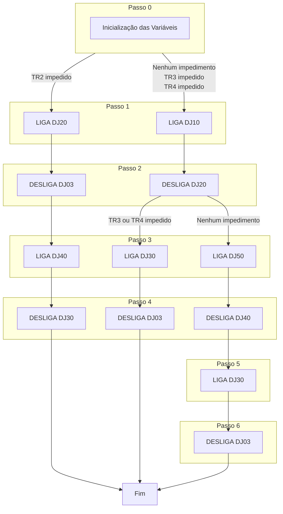

# TM TR1 — Transferência Manual do Transformador TR1

**Referência na especificação:** Seções 1.4.1.1, 1.4.2.1, 1.4.2.3, 1.4.2.5

## Descrição

Sequência de manobras para colocar o **TR1 em impedimento** a partir do estado normal ou de um estado com contingência (TR2, TR3 ou TR4 já impedido). A lógica determina o caminho de transferência de acordo com quais transformadores estão disponíveis.

## Pré-condições de entrada

A sequência é iniciada a partir de uma das seguintes situações:

| Situação de partida | DJ10 | DJ20 | DJ03 | DJ30 | DJ04 | DJ40 | DJ50 | DJ05 | DJ60 | DJ06 |
|--------------------|------|------|------|------|------|------|------|------|------|------|
| 1 – Normal          | DESL | LIG  | LIG  | DESL | LIG  | LIG  | DESL | LIG  | DESL | LIG  |
| 3 – TR2 impedido    | LIG  | DESL | LIG  | LIG  | —    | DESL | LIG  | LIG  | DESL | LIG  |
| 4 – TR3 impedido    | DESL | LIG  | LIG  | DESL | LIG  | LIG  | DESL | DESL | LIG  | LIG  |
| 5 – TR4 impedido    | DESL | LIG  | LIG  | DESL | LIG  | LIG  | DESL | LIG  | LIG  | DESL |

## Estado Final Esperado

Após a conclusão da sequência TM TR1: **Situação 2 — TR1 impedido**

| DJ10 | DJ20 | DJ03 | DJ30 | DJ04 | DJ40 | DJ50 | DJ05 | DJ60 | DJ06 |
|------|------|------|------|------|------|------|------|------|------|
| LIG  | DESL | DESL | LIG  | LIG  | DESL | LIG  | LIG  | DESL | LIG  |

Alimentação resultante: B1A←TR4, B1B←TR2, B2A←TR2, B2B←TR3, B3A←TR3, B4A←TR4

## Lógica de Decisão — Fluxograma

## Caminhos de Execução

### Caminho A — Sem contingência (Situação Normal → TR1 impedido)
*Referência: §1.4.1.1*

| Passo | Comando | Transferência de carga |
|-------|---------|----------------------|
| 1     | LIGA DJ10   | B1A passa a ser alimentada por TR4 (via DJ10) |
| 2     | DESLIGA DJ20 | Separa B1A de B1B |
| 3     | LIGA DJ50   | B2B passa a ser alimentada por TR3 (via DJ50) |
| 4     | DESLIGA DJ40 | Separa B2B de B2A |
| 5     | LIGA DJ30   | B1B passa a ser alimentada por TR2 (via DJ30) |
| 6     | DESLIGA DJ03 | TR1 desconectado |

### Caminho B — TR2 já impedido (Situação 3 → TR1+TR2 impedidos)
*Referência: §1.4.2.1*

| Passo | Comando | Transferência de carga |
|-------|---------|----------------------|
| 1     | LIGA DJ20   | Interliga B1A com B1B via TR4 |
| 2     | DESLIGA DJ03 | TR1 desconectado (B1B passa para TR4 via DJ20) |
| 3     | LIGA DJ40   | Interliga B2A com B2B via TR3 |
| 4     | DESLIGA DJ30 | B2A passa para TR3 via DJ40→DJ50 |

> **Atenção:** Verificar potência disponível e aliviar carga caso necessário antes de iniciar.

### Caminho C — TR3 ou TR4 já impedido (Situação 4 ou 5 → TR1 impedido)
*Referência: §1.4.2.3 (TR3 impedido) e §1.4.2.5 (TR4 impedido)*

| Passo | Comando | Transferência de carga |
|-------|---------|----------------------|
| 1     | LIGA DJ10   | B1A interligada a B4A |
| 2     | DESLIGA DJ20 | Separa B1A de B1B |
| 3     | LIGA DJ30   | B1B passa a ser alimentada por TR2 (via DJ30→DJ04) |
| 4     | DESLIGA DJ03 | TR1 desconectado |

> **Atenção:** Verificar potência disponível e aliviar carga caso necessário antes de iniciar.

## Correspondência com a Normalização

A sequência inversa é a **NM TR1** (Normalização Manual do TR1). Ver `NM_TR1.md`.
