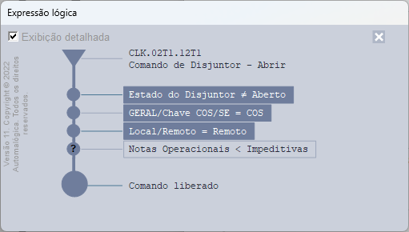

# InterlockDiagram

---

[**DOWNLOAD**](https://tiautomalogica-my.sharepoint.com/:f:/g/personal/engenharia_automapower_com_br/Eurk3QjWNB5Du4wUIJy55-QBUBVEX1HJqGCbDSVC0Xd4Ew?e=3Bueb0)

*Versão mais atual: 11*

*Desenvolvida por:* [*Marcelo Ferreira*](https://automalogica.slack.com/team/U8Q2PU6KG)  
*Mantida por:* [*Gustavo Machado*](https://automalogica.slack.com/team/U90GJJ6KE)

*Dúvidas ou sugestões enviar para o canal:* [*#suporte-bibliotecas-graficas*](https://automapower.slack.com/archives/C04A1RSB7EJ)


---

# Introdução

O InterlockDiagram é um módulo da Automalógica capaz de receber uma expressão lógica contendo PathNames de InternalTags ou medidas do Power que representa as condições necessárias para que um comando seja liberado.

 

# Inserção do módulo no domínio

* Copiar os arquivos interlockdiagram.lib e interlockdiagram.prj da pasta [Templates/Intertravamento/VersaoEstavel](https://tiautomalogica-my.sharepoint.com/:f:/g/personal/engenharia_automalogica_com_br/EkunzhOIdadNgVMrvo_diHYBtEi07PWswZd_x3EQbsbl4g?e=gI87qn) para sua aplicação e adicionar ao domínio. 
* Copiar o ViewerFolder de nome “ild_InterlockDiagramTemplate” do arquivo Viewer.prj disponibilizado na pasta [Templates/Intertravamento/VersaoEstavel](https://tiautomalogica-my.sharepoint.com/:f:/g/personal/engenharia_automalogica_com_br/EkunzhOIdadNgVMrvo_diHYBtEi07PWswZd_x3EQbsbl4g?e=gI87qn) para dentro do Viewer oficial do domínio.


:::warning
**Atenção:** O arquivo Viewer.prj deve permanecer fora das pastas da aplicação e não deve ser inserido no domínio.

:::


:::info
**Nota:** Em aplicações antigas do padrão Automalógica existia uma pasta com figuras chamada **ild_Figuras** no projeto **Controles.prj**. Agora, a pasta **ild_Figuras** já está inclusa no projeto **InterlockDiagram.prj**. Sendo assim, a pasta **ild_Figuras** deve ser apagada do **Controles.prj** senão gerará conflito de nomes e erro no domínio. 

:::

## Integração com temas

O modo HighPerformace suporta diversos temas. Todas as cores usadas estão em Tags Internos. Ao se usar temas, sempre que o tema for alterado as cores dos Tags Internos devem ser alteradas. A biblioteca já possui um tema padrão que, na ausência de outros temas é usado. Os Tags Internos devem ser inseridos dentro no Viwer dentro da pasta InterlockDiagram. A pasta com os Tags já criados pode ser encontrada em Viewer.prj. Os Tags são:

* ColorTextLight: Cor clara para o texto
* ColorTextDark: Cor escura para o texto
* ColorBackground: Cor do fundo
* ColorFill: Cor dos objetos preenchidos
* ColorLineLight: Cor clara da linha
* ColorHorizontalLineLight: Cor clara da linha horizontais que vão dos Leds ao texto
* ColorHorizontalLineDark: Cor escura da linha horizontais que vão dos Leds ao texto
* ColorIcon: Cor do fundo do ícone de fechar

# Abertura da tela de intertravamento

A tela do intertravamento pode ser chamada conforme o exemplo abaixo: 

```vb
Sub OpenDiagramScreen(CommandUnitPathName, HighPerformance)
    Set CommandUnitObj = Nothing
    On Error Resume Next
      Set CommandUnitObj = Application.GetObject(CommandUnitPathName)
    On Error Goto 0
    TypeNameCommandUnit = TypeName(CommandUnitObj)
	IsPower = (TypeNameCommandUnit = "PowerCommandUnit")
	ExecutionMode = IIf(IsPower,2,4) 	
	Set AbrirIntertravamento = Nothing : Set XML_TreeView = Nothing 	
	
    On Error Resume Next 	
	Set AbrirIntertravamento = Screen.AddObject("interlockdiagram.ild_AbrirIntertravamento", True, "ild_AbrirIntertravamento") 	
	Set XML_TreeView = Application.Item("WatchWindowViewerObjects").Item("Global").Item("XML_TreeView").Value 	
	On Error GoTo 0 	
	If Not (AbrirIntertravamento Is Nothing) Then 		
		AbrirIntertravamento.Arg = Array(CommandUnitPathName, ExecutionMode, HighPerformace, XML_TreeView, 5) 'caminho, ExecutionMode, HighPerformace, xml, usarpropriedade(1-scada,5-calculated)...		
		AbrirIntertravamento.Abrir = Not AbrirIntertravamento.Abrir 		
		On Error Resume Next 		
		Screen.DeleteObject AbrirIntertravamento.Name 		
		On Error GoTo 0 		
	Else 		
		Set Fr = Application.GetFrame(Replace(Replace(Replace(Replace(CommandUnitPathName,".",""),"]",""),"[",""),":","")) 	
		Fr.SetFrameOptions "Intertravamentos",1+2+16+64+256+512 		
		Fr.OpenScreen("ild_DiagramScreen"), Array(CommandUnitPathName,ExecutionMode) 		
	End If 	
End Sub 
```

Significados de algumas variáveis presentes no script:

**CommandUnitPathName** - Tipo String, recebe o PathName do comando, seja ele um PowerCommandUnit ou um gtwCommand.

**Expression** – *Tipo String*. Pode ser uma expressão lógica ou o PathName de um CommandUnit 

**ExecutionMode** – *Tipo Inteiro*. Executa o diagrama lógico em modo específico para alguns tipos de aplicação: 


1. Modo OTS 
2. Modo IHM ou SCADA com Elipse Power 
3. Aplicações em Elipse E3 – Expressões formadas por IOTags ou InternalTags. 
4. Aplicações em Elipse E3 – Padrão CPFL Renováveis. 

**HighPerformace** – *Tipo* *Boolean*. Altera entre o modo Normal e HighPerformace