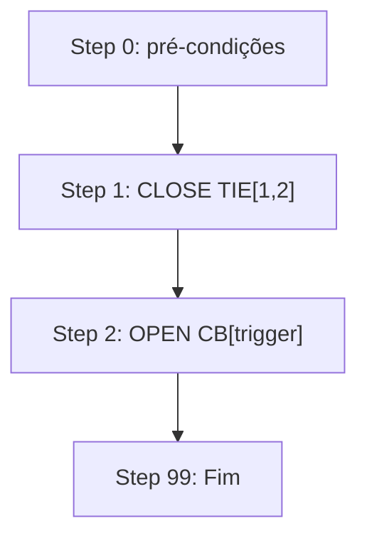
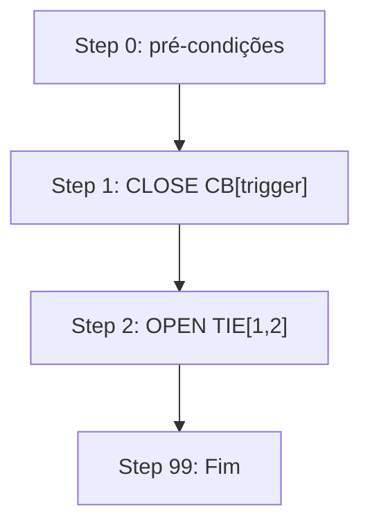
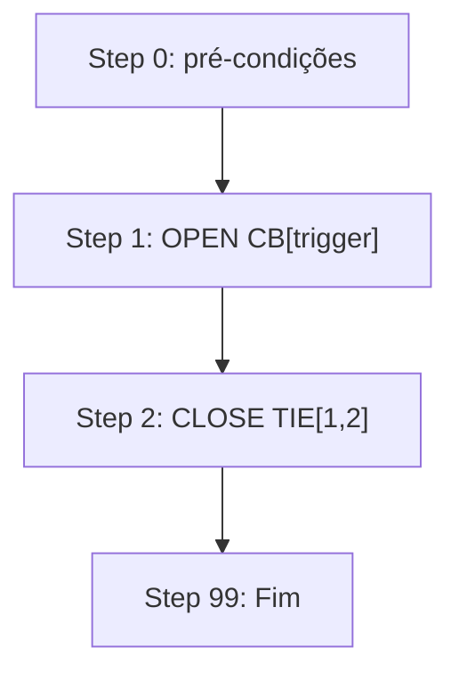

# Layout: 2T-1TIE — Dois Transformadores com Barramento em Sectionamento

**Chave do layout:** `2TR2LV_2BB1TIE` (`Layout.Transformer` = `2TR2LV`, `Layout.Busbar` = `2BB1TIE`)

## Topologia

```
  TR1          TR2
   │            │
  CB1          CB2
   │            │
  B1 ──TIE─── B2
  │            │
 cargas A    cargas B
```

## Mapeamento de Dispositivos

O **ID Lógico** é o valor da propriedade `.Id` que a lógica (`xatm_TMTNM`) usa — é
o contrato, independente do nome de exibição do dispositivo em `xatm_data`.

### Transformadores

| Conceito Abstrato | ID Lógico |
|-------------------|-----------|
| TR1               | 100       |
| TR2               | 200       |

### Disjuntores

| Conceito Abstrato | ID Lógico | Posição |
|-------------------|-----------|---------|
| `CB[1]`           | 120       | Secundário do TR1 → B1 |
| `CB[2]`           | 220       | Secundário do TR2 → B2 |
| `TIE[1,2]`        | 700       | Interligação B1 ↔ B2 (NA) |

Mesmo esquema de numeração do 4T-Ring: `TRn = n×100`, `+20` = disjuntor
secundário, `700` = primeiro disjuntor de interligação de barra.

## Estado Normal

| CB1   | TIE[1,2] | CB2   |
|-------|----------|-------|
| FECHADO | ABERTO | FECHADO |

- B1 ← TR1 (via CB1)
- B2 ← TR2 (via CB2)

## Pré-condição — Contingência é Impeditiva

Este layout tem **um único caminho alternativo**: a TIE. Toda sequência (TM, NM e
TA) depende do outro transformador poder assumir as duas barras, portanto
**nenhuma automação roda enquanto o outro TR está em impedimento**.

`Main_Step00` verifica isso antes de qualquer comando, através de
`ContingencyRefusal`, e encerra a execução com log `"Not executed - ..."`. Não é
falha de passo: **não** levanta o bloqueio geral (`GlobalLockout`) e não exige
reset.

| trigger | Condição de recusa |
|---------|--------------------|
| TR1 (100) | TR2 fora de serviço |
| TR2 (200) | TR1 fora de serviço |
| outro ID  | transformador não pertence ao layout |

## TM — Lógica de Transferência Manual

Não há seleção de caminho por impedimento: há apenas um caminho possível,
independente de qual TR é o trigger.



| Step | Ação | Dispositivo | ID Lógico | Sub |
|------|------|-------------|-----------|-----|
| 1 | CLOSE | `TIE[1,2]` | 700 | `S1TM` |
| 2 | OPEN  | `CB[trigger]` | `triggerId + 20` | `S2TM` |

### Estado Final

| trigger | CB1    | TIE[1,2] | CB2    | B1 alimentada por | B2 alimentada por |
|---------|--------|----------|--------|-------------------|-------------------|
| TR1     | ABERTO | FECHADO  | FECHADO | TR2 (via TIE)    | TR2               |
| TR2     | FECHADO | FECHADO | ABERTO | TR1              | TR1 (via TIE)     |

### Sequência de Passos (pseudocódigo)

```vba
Function GetTMSteps_2T1TIE(trigger As Integer) As String()
    ' Único caminho — sem contingência neste layout
    Dim steps(1) As String
    steps(0) = "CLOSE:TIE[1,2]"
    steps(1) = "OPEN:CB[" & trigger & "]"
    GetTMSteps_2T1TIE = steps
End Function
```

## NM — Normalização Manual (inverso da TM)



| Step | Ação | Dispositivo | ID Lógico | Sub |
|------|------|-------------|-----------|-----|
| 1 | CLOSE | `CB[trigger]` | `triggerId + 20` | `S1NM` |
| 2 | OPEN  | `TIE[1,2]` | 700 | `S2NM` |

`S1NM` não é específico de layout — a NM sempre começa refechando o disjuntor
secundário do próprio TR trigger.

## TA — Transferência Automática

O TR faltoso já está desligado (ou em trip de proteção). A sequência é inversa ao TM:



| Step | Ação | Dispositivo | ID Lógico | Sub |
|------|------|-------------|-----------|-----|
| 1 | OPEN  | `CB[trigger]` | `triggerId + 20` | `S1TA` |
| 2 | CLOSE | `TIE[1,2]` | 700 | `S2TA` |

| Aspecto | TM | TA |
|---------|----|-----|
| Passo 1 | CLOSE TIE | OPEN CB |
| Passo 2 | OPEN CB | CLOSE TIE |
| Motivo | TR ainda vivo — fechar backup primeiro | TR já morto — confirmar isolamento primeiro |

```vba
Function GetTASteps_2T1TIE(trigger As Integer) As String()
    Dim steps(1) As String
    steps(0) = "OPEN:CB[" & trigger & "]"
    steps(1) = "CLOSE:TIE[1,2]"
    GetTASteps_2T1TIE = steps
End Function
```

## Observações

- Toda sequência termina no **step 2** (`nextStep = 99`). Os steps 3 a 6 não
  existem neste layout: se a máquina de estados chegar a um deles,
  `UnsupportedStep` registra o erro e levanta o bloqueio geral, em vez de
  comandar um disjuntor escolhido por omissão.
- Neste layout, um único transformador alimenta ambas as barras durante o
  impedimento — verificar capacidade de sobrecarga antes de executar.
