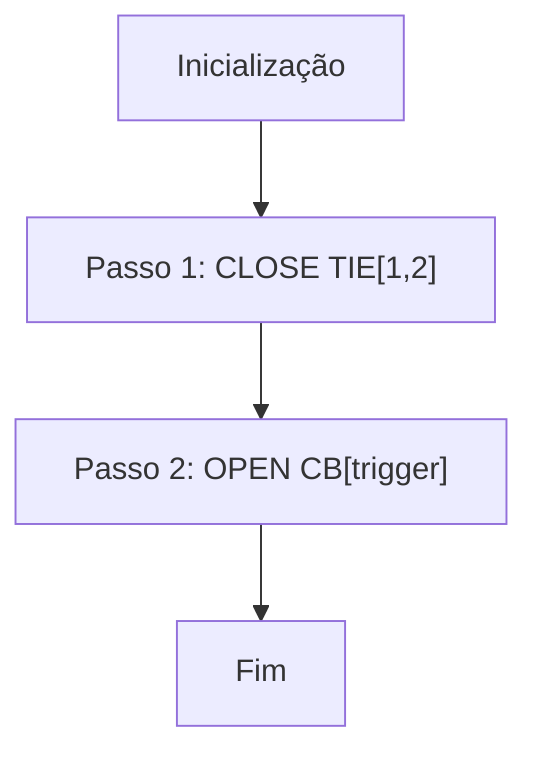
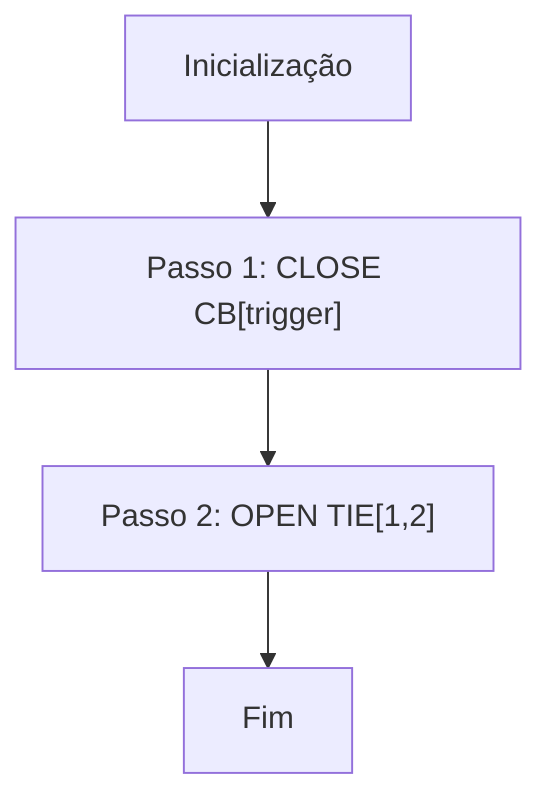
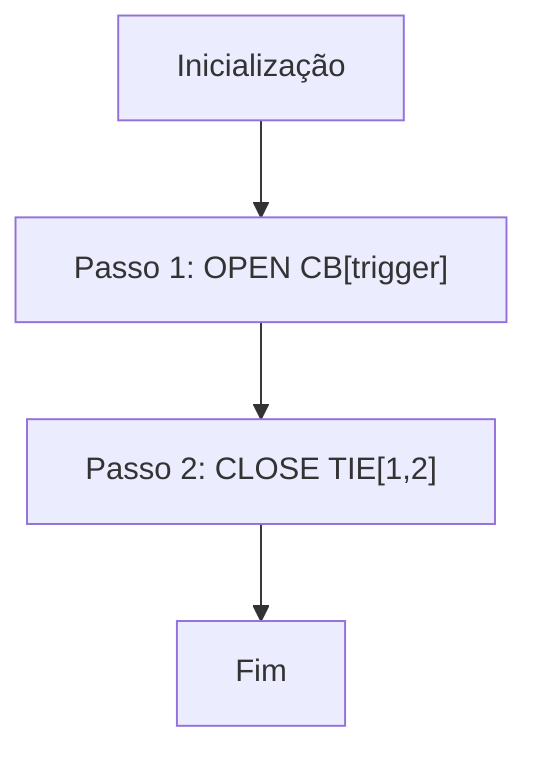

# Layout: 2T-1TIE — Dois Transformadores com Barramento em Sectionamento

## Topologia

```
  TR1          TR2
   │            │
  CB1          CB2
   │            │
  B1 ──TIE─── B2
  │            │
 cargas A    cargas B
```

## Mapeamento de Dispositivos

| Conceito Abstrato | ID Real | Descrição |
|-------------------|---------|-----------|
| `CB[1]`           | (definido por instância) | Disjuntor secundário do TR1 |
| `CB[2]`           | (definido por instância) | Disjuntor secundário do TR2 |
| `TIE[1,2]`        | (definido por instância) | Disjuntor de interligação B1-B2 |

## Estado Normal

| CB1   | TIE[1,2] | CB2   |
|-------|----------|-------|
| FECHADO | ABERTO | FECHADO |

- B1 ← TR1 (via CB1)
- B2 ← TR2 (via CB2)

## TM — Lógica de Transferência Manual

Este layout não tem contingência: há apenas um caminho possível independente de qual TR é o trigger.



### Estado Final

| trigger | CB1    | TIE[1,2] | CB2    | B1 alimentada por | B2 alimentada por |
|---------|--------|----------|--------|-------------------|-------------------|
| TR1     | ABERTO | FECHADO  | FECHADO | TR2 (via TIE)    | TR2               |
| TR2     | FECHADO | FECHADO | ABERTO | TR1              | TR1 (via TIE)     |

### Sequência de Passos (pseudocódigo)

```vba
Function GetTMSteps_2T1TIE(trigger As Integer) As String()
    ' Único caminho — sem contingência neste layout
    Dim steps(1) As String
    steps(0) = "CLOSE:TIE[1,2]"
    steps(1) = "OPEN:CB[" & trigger & "]"
    GetTMSteps_2T1TIE = steps
End Function
```

## NM — Normalização Manual (inverso da TM)



## TA — Transferência Automática

O TR faltoso já está desligado (ou em trip de proteção). A sequência é inversa ao TM:



| Aspecto | TM | TA |
|---------|----|-----|
| Passo 1 | CLOSE TIE | OPEN CB |
| Passo 2 | OPEN CB | CLOSE TIE |
| Motivo | TR ainda vivo — fechar backup primeiro | TR já morto — confirmar isolamento primeiro |

```vba
Function GetTASteps_2T1TIE(trigger As Integer) As String()
    Dim steps(1) As String
    steps(0) = "OPEN:CB[" & trigger & "]"
    steps(1) = "CLOSE:TIE[1,2]"
    GetTASteps_2T1TIE = steps
End Function
```

## Observações

- Neste layout, um único transformador alimenta ambas as barras durante o impedimento — verificar capacidade de sobrecarga antes de executar.
- Não há seleção de caminho por impedimento: a condição de contingência (outro TR já impedido) é **impeditiva** — não é possível realizar TM se o outro TR já está em impedimento.
