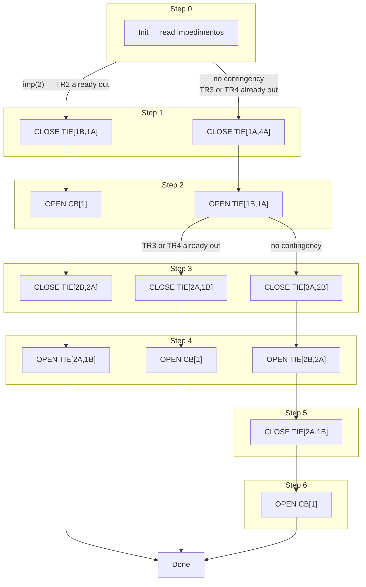
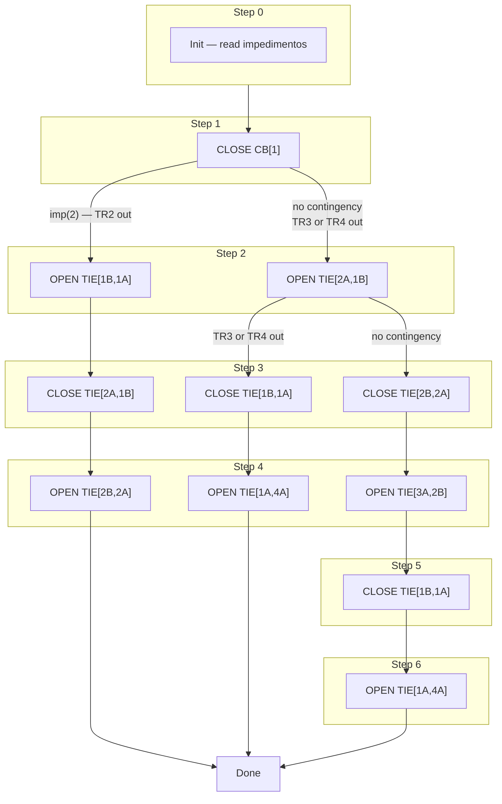
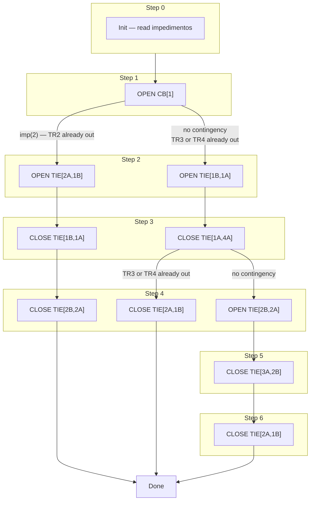
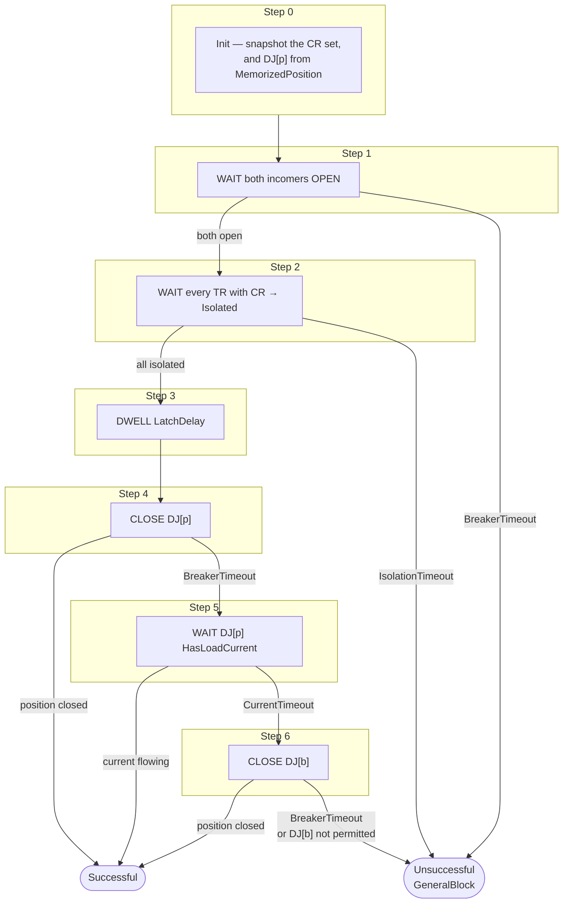

# Maneuver Step Flows — TM / NM / TA / RASEAT

Step sequences for each automation type and layout.
Each step executes only after the previous breaker position is confirmed.

---

## 2T + 1 TIE

```
  TR1       TR2
   │         │
  CB[1]    CB[2]
   │         │
  B1 ──TIE── B2
```

### TM — Manual Transfer  *(make-before-break)*

```mermaid
flowchart LR
    subgraph G0["Step 0"] P0["Init"] end
    subgraph G1["Step 1"] P1["CLOSE TIE[1,2]"] end
    subgraph G2["Step 2"] P2["OPEN CB[trigger]"] end
    G0 --> P1 --> P2 --> DONE(["Done"])
```

### NM — Manual Restore  *(break-before-make)*

```mermaid
flowchart LR
    subgraph G0["Step 0"] P0["Init"] end
    subgraph G1["Step 1"] P1["CLOSE CB[trigger]"] end
    subgraph G2["Step 2"] P2["OPEN TIE[1,2]"] end
    G0 --> P1 --> P2 --> DONE(["Done"])
```

### TA — Automatic Transfer  *(CB already tripped)*

```mermaid
flowchart LR
    subgraph G0["Step 0"] P0["Init"] end
    subgraph G1["Step 1"] P1["OPEN CB[trigger]"] end
    subgraph G2["Step 2"] P2["CLOSE TIE[1,2]"] end
    G0 --> P1 --> P2 --> DONE(["Done"])
```

> **Note:** If both transformers are simultaneously out of service this layout has no valid
> transfer path — TA/TM is blocked by pre-condition check.

---

## 4T Ring — ETD Guarulhos (se_gul)

```
              TR1          TR2                TR3          TR4
               │            │                  │            │
             CB[1]        CB[2]              CB[3]        CB[4]
               │            │                  │            │
TIE[1A,4A]─B1A─TIE[1B,1A]─B1B─TIE[2A,1B]─B2A─TIE[2B,2A]─B2B─TIE[3A,2B]─B3A─TIE[4A,3A]─B4A─(back to B1A)
```

Normal open point: **TIE[1A,4A]** (ring closure, normally open).

---

### TM — TR1 / TR2  *(3 paths depending on contingency)*

Path selection and step structure are the same for TR1 and TR2 — only the final `OPEN CB[n]` differs.
Diagram below uses TR1 notation; replace `CB[1]` with `CB[2]` for TR2.



### TM — TR3 / TR4  *(single path)*

```mermaid
flowchart LR
    subgraph G0["Step 0"] P0["Init"] end
    subgraph G1["Step 1"] P1["CLOSE TIE[4A,3A]"] end
    subgraph G2["Step 2"] P2["OPEN CB[3]  or  CB[4]"] end
    G0 --> P1 --> P2 --> DONE(["Done"])
```

---

NM (Normalização Manual) is the inverse of TM — it restores the substation to the
normal state. The spec tables are read **bottom-to-top** (the reverse of TM). Step
actions still alternate close/open (odd close, even open), and **Step 1 always
re-closes the trigger transformer's own secondary breaker** regardless of contingency.

> Verified against spec §1.4.1.2/.4/.6/.8 (normal) and §1.4.2.2…§1.4.2.24 (contingencies).

### NM — TR1  *(3 paths)*



### NM — TR2  *(3 paths)*

```mermaid
flowchart TD
    subgraph G0["Step 0"] P0["Init"] end
    subgraph G1["Step 1"] P1["CLOSE CB[2]"] end

    subgraph G2["Step 2"]
        P2A["OPEN TIE[2A,1B]"]
        P2B["OPEN TIE[2B,2A]"]
    end
    subgraph G3["Step 3"]
        P3A["CLOSE TIE[2B,2A]"]
        P3B["CLOSE TIE[2A,1B]"]
    end
    subgraph G4["Step 4"]
        P4A["OPEN TIE[3A,2B]"]
        P4B["OPEN TIE[1B,1A]"]
    end
    subgraph G5["Step 5"] P5A["CLOSE TIE[1B,1A]"] end
    subgraph G6["Step 6"] P6A["OPEN TIE[1A,4A]"] end

    G0 --> P1
    P1 -->|"imp(1) — TR1 out"| P2B
    P1 -->|"no contingency\nTR3 or TR4 out"| P2A
    P2B --> P3B
    P2A --> P3A
    P3B --> P4B
    P3A --> P4A
    P4A -->|"no contingency"| P5A
    P4A -->|"TR3 or TR4 out"| F["Done"]
    P5A --> P6A
    P4B --> F
    P6A --> F
```

### NM — TR3  *(4 paths — contingencies all distinct)*

```mermaid
flowchart TD
    subgraph G0["Step 0"] P0["Init"] end
    subgraph G1["Step 1"] P1["CLOSE CB[3]"] end

    subgraph G2["Step 2"]
        P2A["OPEN TIE[4A,3A]"]
        P2B["OPEN TIE[3A,2B]"]
    end
    subgraph G3["Step 3"]
        P3A["CLOSE TIE[3A,2B]"]
        P3B["CLOSE TIE[1A,4A]"]
        P3C["CLOSE TIE[4A,3A]"]
    end
    subgraph G4["Step 4"]
        P4A["OPEN TIE[2B,2A]"]
        P4B["OPEN TIE[1B,1A]"]
        P4C["OPEN TIE[1A,4A]"]
    end

    G0 --> P1
    P1 -->|"imp(4) — TR4 out"| P2B
    P1 -->|"no contingency\nTR1 or TR2 out"| P2A
    P2A -->|"no contingency"| F["Done"]
    P2A -->|"imp(1) — TR1 out"| P3A
    P2A -->|"imp(2) — TR2 out"| P3B
    P2B --> P3C
    P3A --> P4A
    P3B --> P4B
    P3C --> P4C
    P4A --> F
    P4B --> F
    P4C --> F
```

### NM — TR4  *(4 paths — contingencies all distinct)*

```mermaid
flowchart TD
    subgraph G0["Step 0"] P0["Init"] end
    subgraph G1["Step 1"] P1["CLOSE CB[4]"] end

    subgraph G2["Step 2"]
        P2A["OPEN TIE[4A,3A]"]
        P2B["OPEN TIE[1A,4A]"]
    end
    subgraph G3["Step 3"]
        P3A["CLOSE TIE[3A,2B]"]
        P3B["CLOSE TIE[1A,4A]"]
        P3C["CLOSE TIE[4A,3A]"]
    end
    subgraph G4["Step 4"]
        P4A["OPEN TIE[2B,2A]"]
        P4B["OPEN TIE[1B,1A]"]
        P4C["OPEN TIE[3A,2B]"]
    end

    G0 --> P1
    P1 -->|"imp(3) — TR3 out"| P2B
    P1 -->|"no contingency\nTR1 or TR2 out"| P2A
    P2A -->|"no contingency"| F["Done"]
    P2A -->|"imp(1) — TR1 out"| P3A
    P2A -->|"imp(2) — TR2 out"| P3B
    P2B --> P3C
    P3A --> P4A
    P3B --> P4B
    P3C --> P4C
    P4A --> F
    P4B --> F
    P4C --> F
```

---

### TA — TR1  *(3 paths — CB already tripped by protection)*

All paths share Step 1 `OPEN CB[1]` (position confirmation of the tripped breaker) and
Steps 2–3 for Paths A and C. Paths diverge at Step 4.



> **TA TR2 / TR3 / TR4:** same structural pattern, different TIE set. To be specified separately.

---

## Incomer 88/138 kV — RASEAT  *(automatic reclosing)*

```
   BA-2 ─────────────┬──────────────────────┬─────────────
   BA-1 ────────┬────┼─────────────────┬────┼─────────────
                │    │                 │    │
             BA1A0  BA1B0           BA2A0  BA2B0
                └─┬──┘                 └─┬──┘
              RM01DISJ (10)          RM02DISJ (20)
```

The station runs with **one incomer closed and the other open**. A busbar
`CR` on any transformer trips the incomer that was carrying the station *and*
that transformer's secondary breaker, so the whole entry goes dark — RASEAT
is what brings it back.

`DJ[p]` is whichever incomer was carrying the station, `DJ[b]` the other.
Both are worked out at Step 0 from `MemorizedPosition`; neither is
configured, and the sequence never re-reads them, so no step can be handed a
different answer than the step before it.

### RASEAT — reclosing the entry



| Step | Waits for | Timeout | On timeout |
|------|-----------|---------|------------|
| 1 | both incomers open | `BreakerTimeout` | fail |
| 2 | every TR carrying `CR` reports `Isolated` | `IsolationTimeout` | fail |
| 3 | dwell for the bistable mechanism | `LatchDelay` | — |
| 4 | `DJ[p]` position closed | `BreakerTimeout` | → Step 5 |
| 5 | `DJ[p]` load current | `CurrentTimeout` | → Step 6 |
| 6 | `DJ[b]` position closed | `BreakerTimeout` | fail |

**Why this one carries timeouts and the diagrams above do not.** A TM/NM/TA
path is a fixed run of commands once the trigger and contingency are known,
so the only branch worth drawing is the path choice. Three of RASEAT's steps
are *waits* instead, and what happens when the wait expires is part of the
maneuver rather than an error case — Step 4 falling through to Step 5, and
Step 5 to Step 6, are the scheme working as designed.

**Step 2 is a fan-out drawn as one node.** It waits on *every* transformer
carrying `CR`, not one. Several transformers can trip together, and that is
not an ambiguity to resolve but simply a longer step — which is also why
`IsolationTimeout` has to cover the slowest of them, including two motorised
disconnectors travelling before a transformer can call itself isolated.

**Steps 4 and 5 are one close, confirmed two ways.** A breaker that reached
position and one only load current can vouch for are different outcomes, and
the log says which — so each gets a step of its own and its own
`StepExecutionFailed` latch.

---

## Step Count Summary

| Layout | Mode | Trigger | Path | Steps |
|--------|------|---------|------|-------|
| 2T+1TIE | TM / NM / TA | any | — | 2 |
| 4T Ring | TM | TR1 / TR2 | A (no contingency) | 6 |
| 4T Ring | TM | TR1 / TR2 | B or C (1 contingency) | 4 |
| 4T Ring | TM | TR3 / TR4 | — | 2 |
| 4T Ring | NM | TR1 / TR2 | A | 6 |
| 4T Ring | NM | TR3 / TR4 | — | 2 |
| 4T Ring | TA | TR1 | A (no contingency) | 6 |
| 4T Ring | TA | TR1 | B or C (1 contingency) | 4 |
| 2BR2BB | RASEAT | any TR `CR` | primary confirms on position | 4 |
| 2BR2BB | RASEAT | any TR `CR` | primary confirms on current | 5 |
| 2BR2BB | RASEAT | any TR `CR` | falls back to the other incomer | 6 |
