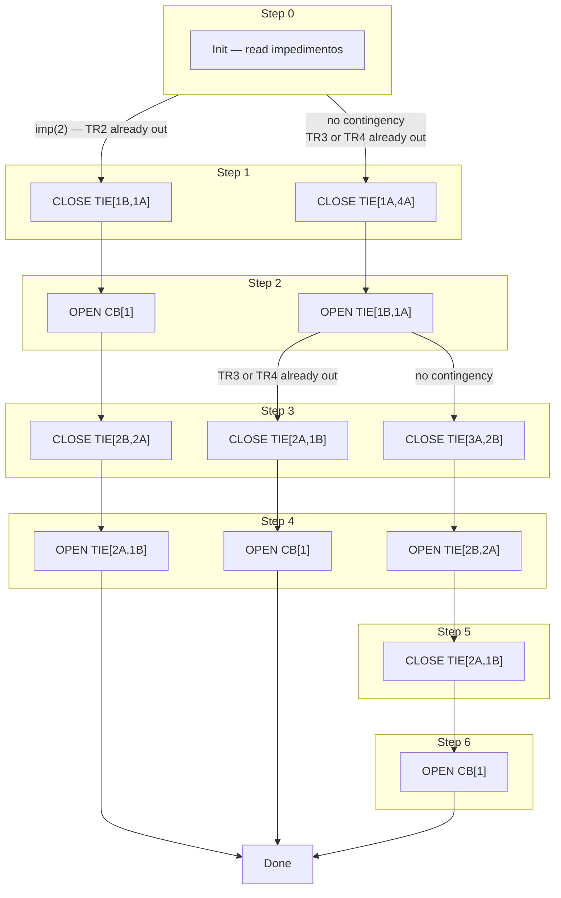
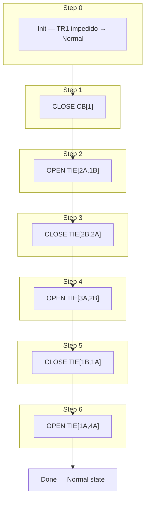
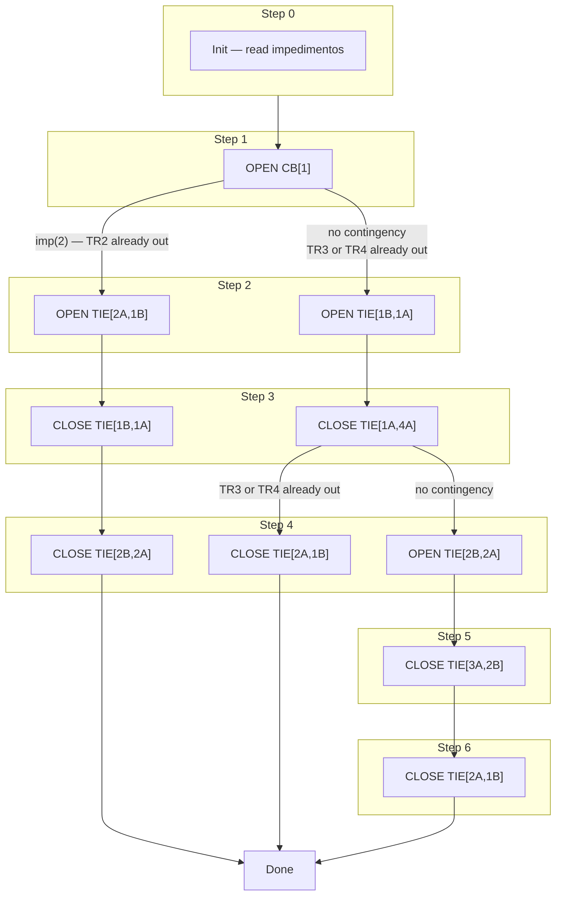

# Maneuver Step Flows — TM / NM / TA

Step sequences for each automation type and layout.
Each step executes only after the previous breaker position is confirmed.

---

## 2T + 1 TIE

```
  TR1       TR2
   │         │
  CB[1]    CB[2]
   │         │
  B1 ──TIE── B2
```

### TM — Manual Transfer  *(make-before-break)*

```mermaid
flowchart LR
    subgraph G0["Step 0"] P0["Init"] end
    subgraph G1["Step 1"] P1["CLOSE TIE[1,2]"] end
    subgraph G2["Step 2"] P2["OPEN CB[trigger]"] end
    G0 --> P1 --> P2 --> DONE(["Done"])
```

### NM — Manual Restore  *(break-before-make)*

```mermaid
flowchart LR
    subgraph G0["Step 0"] P0["Init"] end
    subgraph G1["Step 1"] P1["CLOSE CB[trigger]"] end
    subgraph G2["Step 2"] P2["OPEN TIE[1,2]"] end
    G0 --> P1 --> P2 --> DONE(["Done"])
```

### TA — Automatic Transfer  *(CB already tripped)*

```mermaid
flowchart LR
    subgraph G0["Step 0"] P0["Init"] end
    subgraph G1["Step 1"] P1["OPEN CB[trigger]"] end
    subgraph G2["Step 2"] P2["CLOSE TIE[1,2]"] end
    G0 --> P1 --> P2 --> DONE(["Done"])
```

> **Note:** If both transformers are simultaneously out of service this layout has no valid
> transfer path — TA/TM is blocked by pre-condition check.

---

## 4T Ring — ETD Guarulhos (se_gul)

```
              TR1          TR2                TR3          TR4
               │            │                  │            │
             CB[1]        CB[2]              CB[3]        CB[4]
               │            │                  │            │
TIE[1A,4A]─B1A─TIE[1B,1A]─B1B─TIE[2A,1B]─B2A─TIE[2B,2A]─B2B─TIE[3A,2B]─B3A─TIE[4A,3A]─B4A─(back to B1A)
```

Normal open point: **TIE[1A,4A]** (ring closure, normally open).

---

### TM — TR1 / TR2  *(3 paths depending on contingency)*

Path selection and step structure are the same for TR1 and TR2 — only the final `OPEN CB[n]` differs.
Diagram below uses TR1 notation; replace `CB[1]` with `CB[2]` for TR2.



### TM — TR3 / TR4  *(single path)*

```mermaid
flowchart LR
    subgraph G0["Step 0"] P0["Init"] end
    subgraph G1["Step 1"] P1["CLOSE TIE[4A,3A]"] end
    subgraph G2["Step 2"] P2["OPEN CB[3]  or  CB[4]"] end
    G0 --> P1 --> P2 --> DONE(["Done"])
```

---

### NM — TR1 / TR2  *(restore from standard impedido state → normal)*

Inverse of TM Path A. Each CLOSE step re-energises a busbar via its normal source;
each OPEN step removes the backup connection established during TM.



> **Contingency NM paths (B and C):** correspond to the inverse of TM Paths B and C.
> They start from the dual-impedimento state left by that TM path. To be specified in `NM_TR1.md`.

### NM — TR3 / TR4  *(single path)*

```mermaid
flowchart LR
    subgraph G0["Step 0"] P0["Init"] end
    subgraph G1["Step 1"] P1["CLOSE CB[3]  or  CB[4]"] end
    subgraph G2["Step 2"] P2["OPEN TIE[4A,3A]"] end
    G0 --> P1 --> P2 --> DONE(["Done"])
```

---

### TA — TR1  *(3 paths — CB already tripped by protection)*

All paths share Step 1 `OPEN CB[1]` (position confirmation of the tripped breaker) and
Steps 2–3 for Paths A and C. Paths diverge at Step 4.



> **TA TR2 / TR3 / TR4:** same structural pattern, different TIE set. To be specified separately.

---

## Step Count Summary

| Layout | Mode | Trigger | Path | Steps |
|--------|------|---------|------|-------|
| 2T+1TIE | TM / NM / TA | any | — | 2 |
| 4T Ring | TM | TR1 / TR2 | A (no contingency) | 6 |
| 4T Ring | TM | TR1 / TR2 | B or C (1 contingency) | 4 |
| 4T Ring | TM | TR3 / TR4 | — | 2 |
| 4T Ring | NM | TR1 / TR2 | A | 6 |
| 4T Ring | NM | TR3 / TR4 | — | 2 |
| 4T Ring | TA | TR1 | A (no contingency) | 6 |
| 4T Ring | TA | TR1 | B or C (1 contingency) | 4 |
